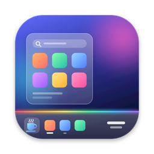
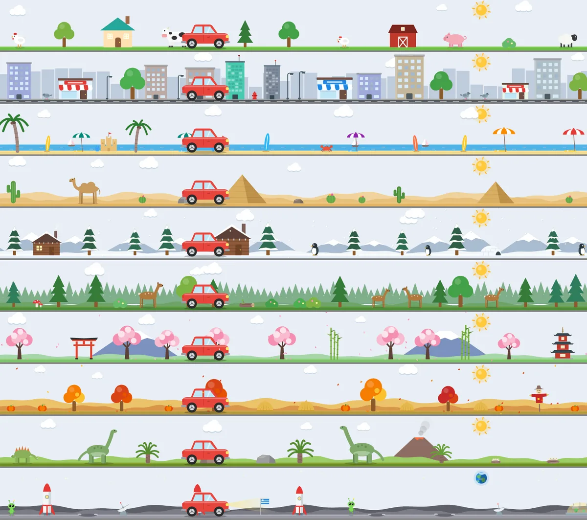
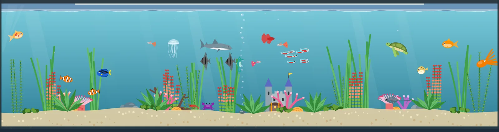
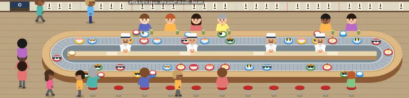
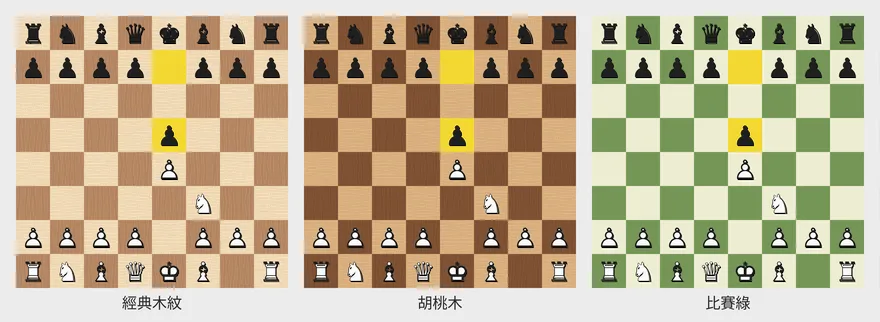
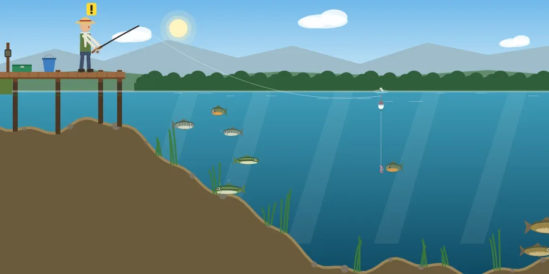

  

<h1 align="center">Mochabar</h1>

  <b>A real Windows-style taskbar for macOS.</b> 
  Every window gets its own button, a lone tap of ⌘ opens Start, and the clock and system tray sit in the corner.

  <a href="https://github.com/bittyferrari/mochabar/releases/latest/download/Mochabar.zip"><b>Download (free)</b></a> ·
  <a href="https://bittyferrari.github.io/mochabar/">Website</a> ·
  <a href="https://github.com/bittyferrari/mochabar/releases">Release notes</a> ·
  <a href="https://discord.gg/5nvBfsbfjM">Discord</a>

---

## Why

I used Windows for years before getting a Mac, and never got used to the Dock. With several Finder windows open, finding the right one turns into guesswork. Mochabar puts every window on a taskbar so you can see it and click it, the way Windows does.

It runs alongside the Dock rather than replacing it. Most people set the Dock to auto-hide or move it to the side.

## Features (free)

- **One button per window.** Every window is listed, like Windows' "never combine". Drag to reorder, middle-click to close. A combined mode is one click away.
- **Tap ⌘ for Start.** Only a lone tap triggers it, so ⌘C, ⌘Tab and other shortcuts work as usual. Choose the left, right or either ⌘ key.
- **Start menu with search.** Type and press Enter. It has pinned apps, all apps, folders and power options, and you can resize it.
- **Full system tray.** Battery, volume slider, Wi-Fi, Bluetooth, input source, CPU / memory / network graphs and Focus. Each one is optional.
- **Clock and calendar.** Click the clock for a calendar with today's events. The last pixel in the corner is Show Desktop.
- **Appearance.** Glass styles, gradients, height, centered or left-aligned icons, plus three retro theme packs.
- **Multiple displays.** Each display gets its own taskbar showing the windows on the current Space.
- **20 languages.** Settings can be exported as JSON and imported again.

## Pro extras (optional)

Purely for fun, and none of them is needed for the taskbar itself:

- **RGB lighting** with 21 effects, including a music mode that shows a live spectrum of your system audio. Only the spectrum is computed; nothing is recorded.
- **12 animated scenes** that live above the taskbar in a click-through layer: a little car driving through 10 worlds, an aquarium, a sushi bar, a zoo and more. The car reacts to your Mac: it slows down when the battery is low and heads to a charger when you plug in.
- **9 mini games** you open from the tray: chess, Go, fishing, pipes, a tower defense, a space shooter, a farm and more.

  

  
  
  
  

## Pricing

| | Free | Pro |
|---|---|---|
| Taskbar, Start menu, system tray, calendar | ✅ | ✅ |
| Appearance options and retro themes | ✅ | ✅ |
| Multiple displays, 20 languages | ✅ | ✅ |
| RGB lighting, animated scenes, mini games | — | ✅ |
| Price | Free forever | **US$10 once**, no subscription |

Every download includes a **14-day Pro trial**. A license works on up to 3 Macs. When the trial ends, the taskbar and all free features keep working.

[Get Pro](https://bittyferrari.lemonsqueezy.com/checkout/buy/5678601a-9ae7-4f4b-8167-6c24040014d6)

## Install

1. [Download Mochabar.zip](https://github.com/bittyferrari/mochabar/releases/latest/download/Mochabar.zip), unzip it, move **Mochabar** to Applications and open it.
2. Allow **Accessibility**. It is needed to list, switch and close windows.
3. Allow **Input Monitoring**. It is only used to detect a lone ⌘ tap.
4. Optionally let the welcome screen move the Dock to the side and hide the menu bar.

**Requirements:** macOS 13 Ventura or later, Apple silicon.

## Privacy and safety

- Signed with a Developer ID and **notarized by Apple**, so it opens without the "unidentified developer" warning.
- Accessibility is only used to manage windows. Input Monitoring only checks whether ⌘ was tapped on its own. Nothing you type is recorded or sent anywhere.
- The only network requests are license activation and validation for Pro.

## Why it's not on the Mac App Store

A taskbar has to read and control other apps' windows through the Accessibility API, and the App Store sandbox doesn't allow that. Mochabar is distributed here instead, signed and notarized.

## Known limitations

- macOS has no public API to reserve screen space, so maximized windows may slightly overlap the taskbar.
- Apple silicon only for now.

## Feedback

Found a bug or want a feature? [Open an issue](https://github.com/bittyferrari/mochabar/issues) or come say hi on [Discord](https://discord.gg/5nvBfsbfjM).

---

Mochabar is an independent product and is not affiliated with, endorsed by, or sponsored by Apple Inc. or Microsoft Corporation. Mac, macOS and Dock are trademarks of Apple Inc., registered in the U.S. and other countries. Windows is a trademark of Microsoft Corporation.
